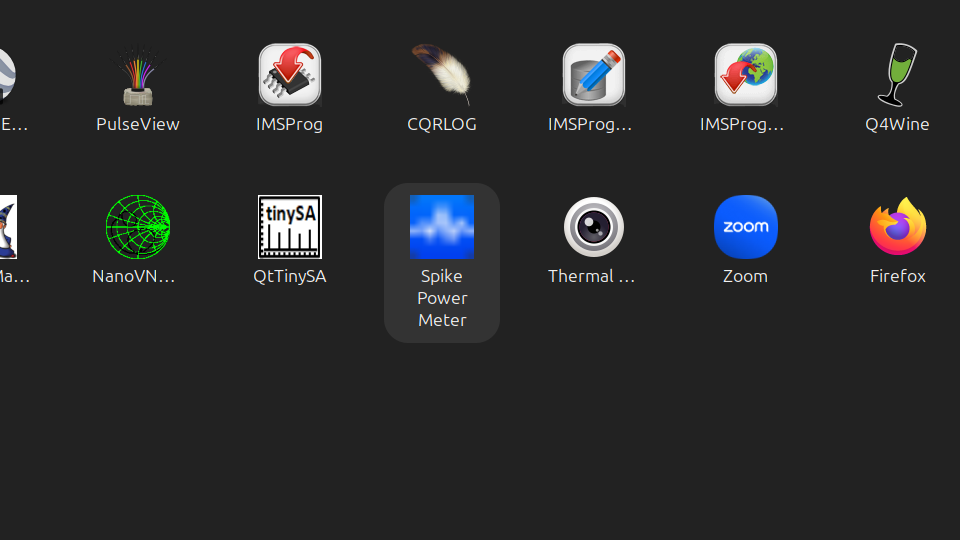
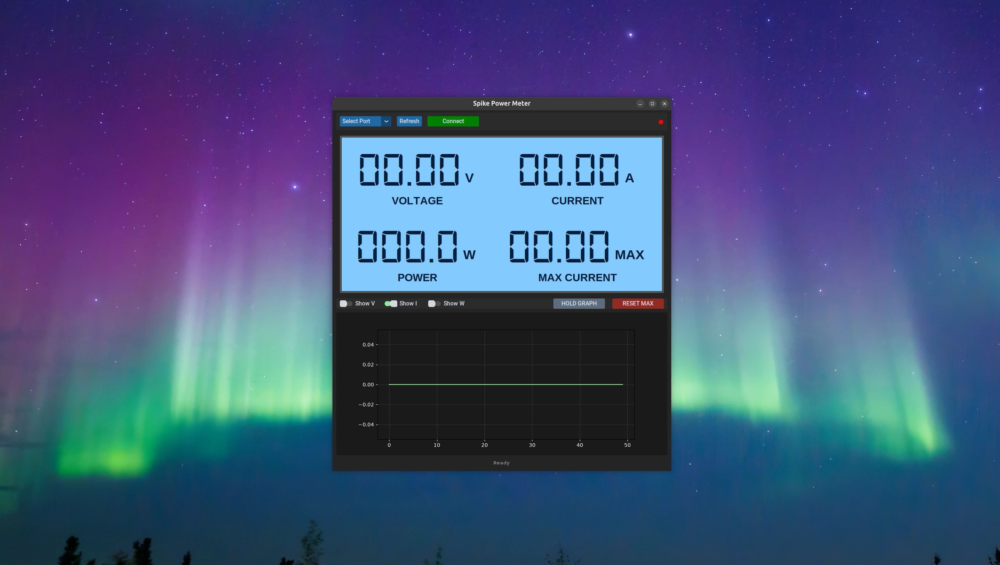

This is a fork of this Repo https://github.com/theastronate/Dell-Spike-Power-Meter-PC-Connect

Huge thanks to @theastronate and Dell Parts People for making this, I have made only the changes to get this to run from the gui on Ubuntu. I plan to make this an appimage so it can run on any linux distro. 

# 🔌 Spike Power Meter Digitizer (USB-C Pro Upgrade)

This is the USB-C upgraded version of my Dell power meter. You can build this [Dell/Alienware Laptop Power Meter Box](https://www.thingiverse.com/thing:7031863) by printing following the build list. This project replaces standard analog readouts with an **ESP32-C3** and an **INA226** high-side sensor, streaming live power data over **USB-C** to a custom Python dashboard.

 Added support for linux python to run, it will identify what OS is it running on and formulate the icon based on that.There is an example spikepowermeter.desktop file in the repo for Debian/Ubuntun distros. There is an install.sh script that will work to install it. On Debian/ubuntu clone this repo, and navigate to the folder. Run the following:

 chmod +x install.sh
./install.sh

This will download your dependencies and install them, move the icons and create the desktop launcher for the python code. Once that is done it will look like this. 





## ✨ Features

- **Dual-Jack Support:** Compatible with 7.4mm and 4.5mm Dell/Alienware barrel chargers.
- **High Precision:** Uses the **INA226** via I2C with a **0.002 Ohm shunt** for accurate high-current readings (up to 25A).
- **Digital-7 Dashboard:** A custom Python UI built with `customtkinter` that mimics the classic blue LCD 7-segment display.
- **Live Graphing:** Real-time visual tracking of Voltage (V), Amps (I), and Watts (W).
- **Max Current Hold:** Automatically captures and holds peak amperage for diagnostic review.
 
 Added support for linux python to run, it will identify what OS is it running on and formulate the icon based on that.
---

## 🛠️ Hardware Setup

### Components

- **Microcontroller:** [ESP32-C3](https://amzn.to/4cqRlRE)
- **Sensor/Shunt:** [INA226 High-Side Current Sensor with R002 (0.002 Ohm)](https://amzn.to/4tzMGDz)
- **Enclosure:** [3D Printed Case via Thingiverse](https://www.thingiverse.com/thing:7031863)

### Wiring (ESP32-C3)

| INA226 Pin | ESP32-C3 Pin |
| :--------- | :----------- |
| VCC        | 5V           |
| GND        | GND          |
| SDA        | GPIO 8       |
| SCL        | GPIO 9       |

---

## 🚀 Quick Start Guide

### 1. Firmware Installation (PlatformIO)

Create a `platformio.ini` with the following configuration:

```ini
[env:esp32-c3-devkitm-1]
platform = espressif32
board = esp32-c3-devkitm-1
framework = arduino
monitor_speed = 115200
lib_deps = robtillaart/INA226 @ ^0.6.0
```

Flash the provided .cpp firmware to your ESP32-C3 via USB-C.

### 2. Python Dashboard Setup

Ensure you have Python 3.9+ installed, then:

## Clone the repository

git clone https://github.com
cd Dell-Power-Meter-PC-Connect

## Install dependencies

```
pip install -r requirements.txt
```

### 3. Running the App

Ensure the digital-7.ttf font file is in the project root, then run:

```
python dpm_ui.py
```

### 4. Building a standalone Windows executable

From PowerShell in the project root, run:

```powershell
.\build-exe.ps1
```

The single-file, windowed application is written to `dist\Spike Power Meter.exe`.
It embeds Python, the Python packages, CustomTkinter assets, and the Digital-7
font, so the target Windows computer does not need Python or supporting files.

1.  Select the COM Port for your device.
2.  Click Connect.
3.  Use the toggle switches to view live plots for Voltage, Current, or Power.

---

## 📊 Data Protocol

The ESP32 sends a comma-separated string every 250ms via Serial:
Voltage,Current_A,Power_W,Shunt_mV

---

## 🤝 Credits

- Original Case Design: [Thingiverse #7031863](https://www.thingiverse.com/thing:7031863)
- Firmware & Software: [Nathan Morgan (Parts-People.com)]
